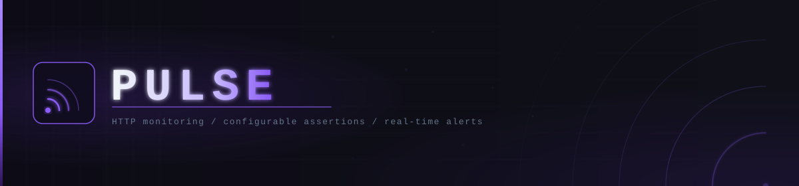

  

<h1 align="center">Pulse</h1>

  API monitoring platform — real-time uptime tracking with configurable assertions

  
  
  
  
  

---

## Overview

Pulse executes periodic HTTP checks against registered endpoints, evaluates configurable assertions per monitor, persists the result history, and sends alerts when a service changes state. The dashboard reflects all monitor states in real time via WebSockets.

## Documentation

| Document | Description |
|----------|-------------|
| [PLX-OVW-001](docs/core/PLX-OVW-001-overview.md) | Project overview and stack |
| [PLX-ARCH-002](docs/technical/PLX-ARCH-002-architecture.md) | System architecture and modules |
| [PLX-DATA-003](docs/technical/PLX-DATA-003-data-model.md) | Data model and MongoDB schemas |
| [PLX-API-004](docs/api/PLX-API-004-reference.md) | API reference |
| [PLX-UC-005](docs/core/PLX-UC-005-use-cases.md) | User-facing use cases |
| [PLX-ADR-006](docs/core/PLX-ADR-006-decisions.md) | Architecture decision records |

## Stack

**Backend** — NestJS / TypeScript / MongoDB (Mongoose) / BullMQ + Redis / WebSockets

**Frontend** — React 18 / Vite / TypeScript / Tailwind CSS / Zustand

## Author

[github.com/Loksz](https://github.com/Loksz)
